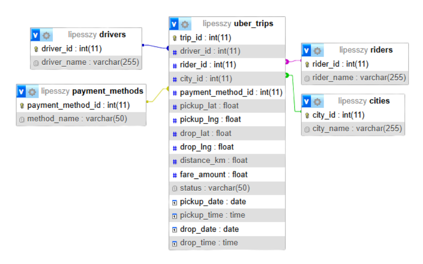
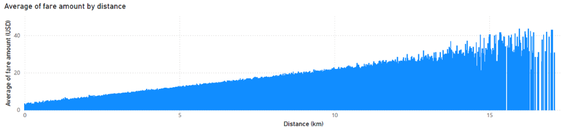

# Uber-TLC: Uber Trip Analysis 
> **Course project**: Advanced Databases, AGH University of Krakow  
> **Dataset**: [~50,000 U.S. Uber synthetic trip records across 10 major metropolitan hubs (Jan 1 - Feb 2, 2023)](https://www.kaggle.com/datasets/rohiteng/uber-trips-dataset?fbclid=IwY2xjawTUm2NwZG9mAWV4dG4DYWVtAjEwAGJyaWQRMDB3NU5JazBnbEljbkNESDhzcnRjBmFwcF9pZBAyMjIwMzkxNzg4MjAwODkyAAEew8eGsYrNPfzauZJI133EJOJeGWiDXp4v07lWeRGbx3ecp840nbON382eTdI_aem_JbssVZD3SXiFDNDtLAoUUw)      
> **Tech Stack**: Python (Pandas, SQLAlchemy, Faker), MySQL, PowerBI

## Results

### 1. Database Schema & Architecture
Relational model linking the central `uber_trips` fact table with 4 dimension tables (`drivers`, `riders`, `cities`, `payment_methods`).

  

### 2. Quantitative Analysis (Fare Amount vs. Trip Distance)
Regression trend showing the linear relationship between distance and total trip fare, filtered dynamically by payment method and city.

  

## What is the Uber-TLC Analysis and why does it matter?

Without proper dimensional modeling, running complex spatial and temporal analytics directly on event logs results in poor query performance and data inconsistency. This project addresses these challenges by transforming raw trip logs into a fully normalized MySQL relational database and exposing an interactive dashboard for temporal, spatial, and quantitative insights.

## Key Relational Features:
* **One-to-Many ($1:N$) Relationships:** Enforced via strict SQL Foreign Keys.
* **Data Integrity:** Cascade checks prevent orphan records between dimension tables and fact logs.
* **Storage Optimization:** String labels (e.g., city names, payment methods) are extracted into lookup tables to reduce redundancy across 50,000 rows.

## ETL & Data Processing Pipeline

Raw CSV ──► Coordinate Bounding ──► Anonymization ──► Time Split ──► MySQL Indexing

| # | Step | Key Detail |
| :---: | :--- | :--- |
| **1** | **Extraction** | Loaded 50,000 raw trip logs covering Jan 1 - Feb 2, 2023 |
| **2** | **Geospatial Correction** | Mapped points to realistic city bounding boxes (e.g., NY: `lat(40.49, 40.92)`, `lng(-74.26, -73.70)`) weighted by market share |
| **3** | **Anonymization** | Generated unique synthetic names for drivers and riders |
| **4** | **Temporal Standardization** | Split timestamps into explicit SQL Date and Time types |
| **5** | **Dimensional Mapping** | Converted categorical strings into indexed integer IDs for city_id and payment_method_id |
| **6** | **Database Import** | Automated schema creation, table population, and constraint creation via SQLAlchemy |

---